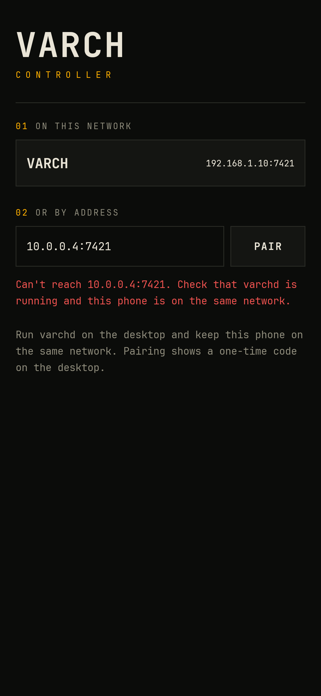
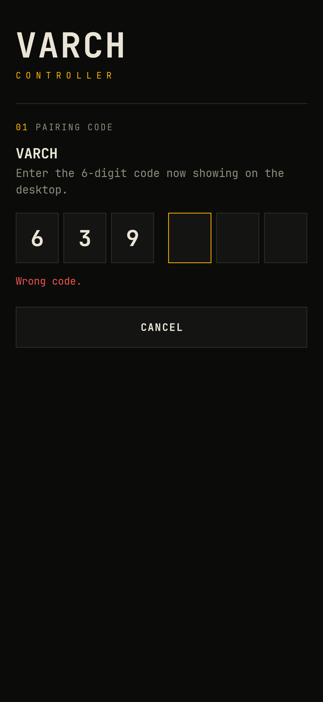

# Varch Controller

[](https://github.com/SVIGHNESH/VarchController/actions/workflows/ci.yml)
[](https://github.com/SVIGHNESH/VarchController/releases/latest)
[](LICENSE)

A phone remote for a Hyprland desktop.
`varchd` is a small Go daemon that runs on the desktop, and the Android app pairs with it over your home network or Tailscale.

<p>
  
  
  
</p>

## What it does

The app has five tabs.

- **DECK** has media controls with seek and cover art, volume, brightness, and workspaces 1-10.
- **PAD** is a trackpad and keyboard, with a SLIDES mode for presentations.
- **DESK** lists open windows and launches apps.
- **SYS** shows battery, CPU, memory and temperature, and holds the system toggles and power keys.
- **SHARE** moves clipboard text, links and screenshots between the phone and the desktop, and casts either screen to the other.

The app recolours itself to match the desktop's Omarchy theme, and follows along when you change it.

It also adds three quick-settings tiles, four home-screen widgets, a share-sheet target, and optional desktop battery alerts.
The widgets show what is playing, the desktop's status and its workspaces, and control them without opening the app.

## Requirements

- A Linux desktop running Hyprland, with PipeWire audio.
  Night light and theme switching need Omarchy.
- An Android phone on Android 8 or newer.
- Both on the same Wi-Fi, or both on Tailscale.

## Quick start

It takes about five minutes, and you do not need Go or Android Studio.

### 1. Install the tools the daemon uses

On Arch or Omarchy, most of these are already there.

```sh
sudo pacman -S --needed wireplumber libpulse brightnessctl wtype wl-clipboard grim \
  networkmanager bluez-utils power-profiles-daemon libnotify avahi mpv
```

`avahi` lets the phone find the desktop by itself, and `mpv` shows the phone's screen on the desktop.
Both are optional.

### 2. Install the daemon on the desktop

Run this in a terminal inside your Hyprland session.
It downloads the latest release and starts `varchd` as a user service.

```sh
arch=$(uname -m | sed 's/x86_64/amd64/; s/aarch64/arm64/')
curl -fsSL https://api.github.com/repos/SVIGHNESH/VarchController/releases/latest |
  grep -o "https://[^\"]*linux-$arch.tar.gz" | xargs curl -fsSL | tar xz
cd varchd-*-linux-$arch
install -Dm755 varchd ~/.local/bin/varchd
install -Dm644 varchd.service ~/.config/systemd/user/varchd.service
systemctl --user daemon-reload
systemctl --user enable --now varchd.service
```

Check that it is running:

```sh
systemctl --user status varchd
```

### 3. Open the port

Skip this if you have no firewall.
With `ufw`:

```sh
sudo ufw allow 7421/tcp
```

### 4. Install the app on the phone

Open the [latest release](https://github.com/SVIGHNESH/VarchController/releases/latest) on the phone and download `varch-controller-X.Y.Z.apk`.
Tap the file to install it.
Android asks you to allow installs from your browser or file manager the first time.

### 5. Pair

1. Open the app.
   The desktop shows up under "On this network".
   If it does not, type the desktop's IP address under "Or by address".
2. A notification on the desktop shows a 6-digit code.
3. Type the code into the app.

<p>
  
  
</p>

That is all.
The phone stays paired until you tap UNPAIR on the SYS tab.

## If something does not work

- **The desktop is not in the list.**
  Type its address by hand.
  `ip -4 addr` on the desktop shows it.
  The list needs `avahi`, and it does not work over Tailscale.
- **The app cannot connect.**
  The firewall is the usual cause, so go back to step 3.
  Then confirm the daemon is up with `systemctl --user status varchd`.
- **No pairing code appears.**
  The code is also written to the log: `journalctl --user -u varchd -f`.
- **A control does nothing.**
  The tool behind it is probably missing, so go back to step 1.

## Updating and removing

To update the daemon, run step 2 again.
To update the app, install the newer APK over the old one.
Paired phones stay paired across updates.

To remove the daemon:

```sh
systemctl --user disable --now varchd.service
rm ~/.local/bin/varchd ~/.config/systemd/user/varchd.service
```

## Before you pair

Pairing a phone is close to handing someone your keyboard, so only pair phones you control.
Traffic on your Wi-Fi is not encrypted.
For anything beyond a home network, use Tailscale, which [Setup](docs/setup.md#using-tailscale) walks through.
[Security](docs/security.md) has the details.

## Documentation

- [Setup](docs/setup.md): every install method, firewall, Tailscale, pairing, and the app launcher list.
- [Using the app](docs/guide.md): every tab, the tiles, the widget, and sharing.
- [Security](docs/security.md): what a paired phone can do and what protects the daemon.
- [Protocol](docs/protocol.md): the HTTP and WebSocket API and the full action list.
- [Development](docs/development.md): layout, building from source, tests, and known gaps.
- [Releasing](docs/releasing.md): the CI and release pipeline, and its one-time setup.

## Licenses

Varch Controller is released under the [MIT License](LICENSE).
The app bundles JetBrains Mono (Nerd Font build) under the SIL Open Font License 1.1, included in [licenses/JetBrainsMono-OFL.txt](licenses/JetBrainsMono-OFL.txt).
