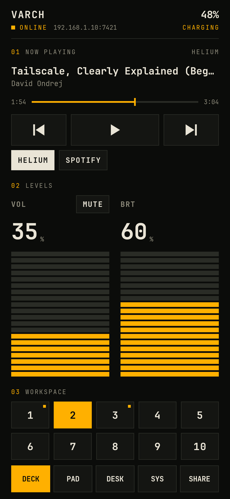
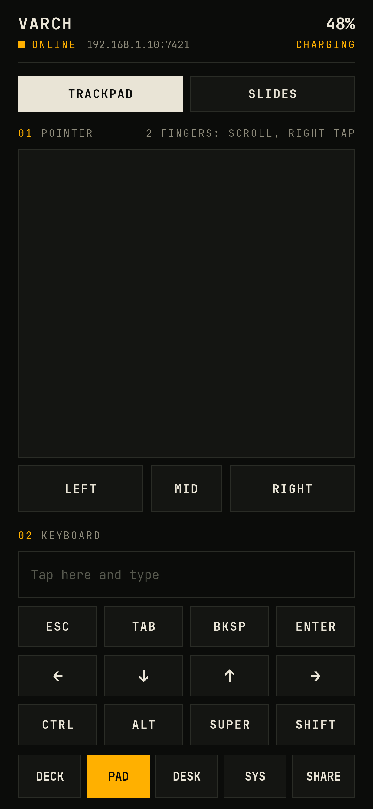
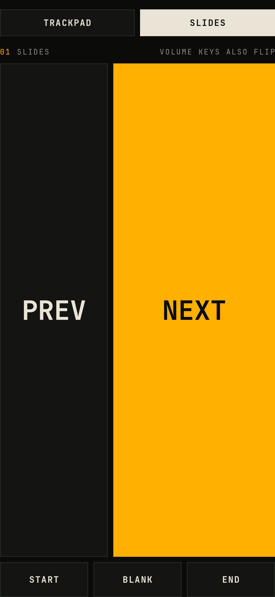
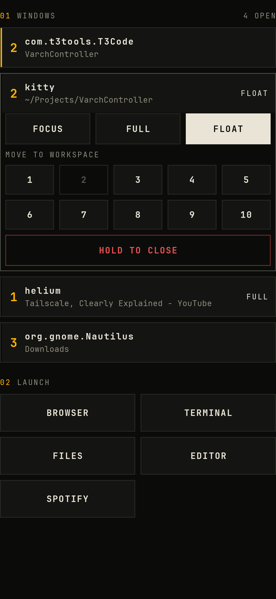
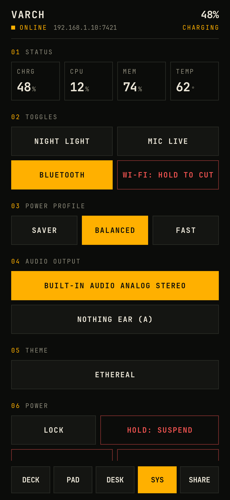
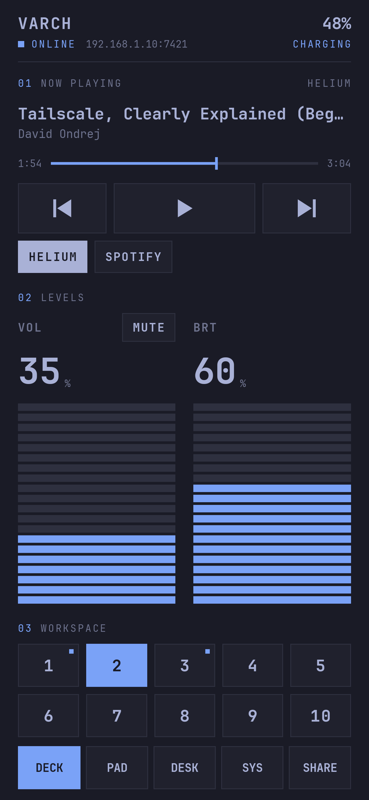
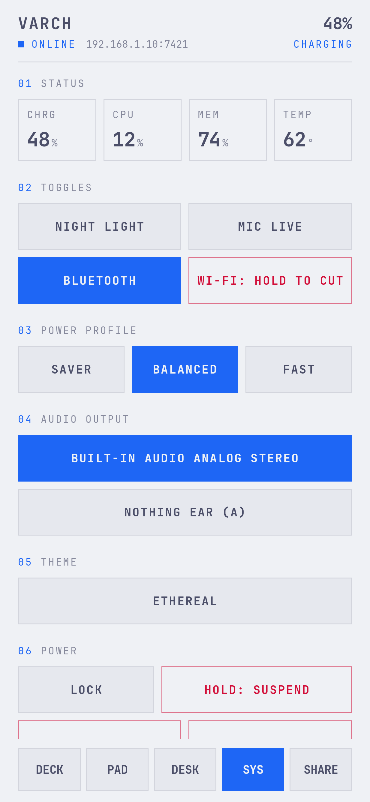
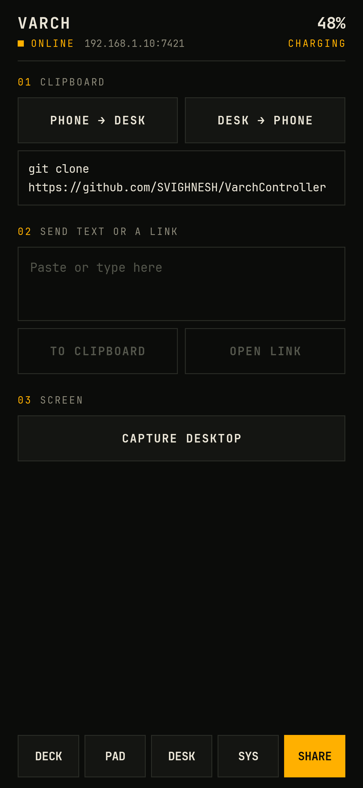
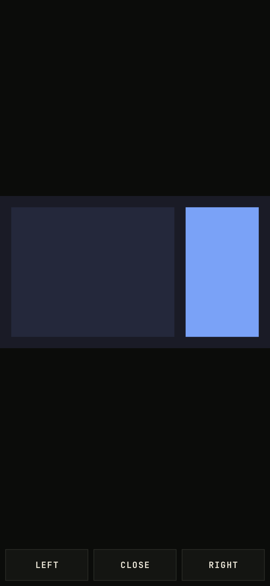

# Using the app

The header shows the desktop's name, whether the phone is connected, and the desktop's battery.
When an action fails or a transfer finishes, a short message replaces the address for three seconds.

Controls dim while the desktop is unreachable.
The app reconnects by itself and connects again each time you open it.

## DECK

- The transport keys control whichever media player is playing.
  When several players are running, a row of player keys appears and you pick one.
- Drag the seek bar and lift your finger to jump.
- The faders move relative to where your finger lands, so a stray touch does not jump the volume.
  MUTE sits above the volume fader.
- Brightness stops at 1% so the screen never goes fully dark.
- The workspace keys switch workspace.
  The lit key is the current one and a small dot marks workspaces that have windows.

While the app is open, the phone's volume buttons change the desktop volume in 5% steps.

## PAD

### Pointer

| Gesture | Result |
| --- | --- |
| Drag one finger | Move the pointer. Faster strokes travel further. |
| Tap | Left click. |
| Tap with two fingers | Right click. |
| Drag two fingers | Scroll. The content follows your fingers. |
| Hold LEFT and drag on the pad | Drag, or select text. |

LEFT, MID and RIGHT stay pressed for as long as you hold them.

### Keyboard

Tap the text field and type.
Each character goes to the desktop as you type it, and backspace and autocorrect changes are mirrored.
The send key on the phone keyboard presses Enter.

CTRL, ALT, SUPER and SHIFT latch for one key.
Tap CTRL and then type `c` to send Ctrl+C, or tap ALT and then TAB.

### Slides

SLIDES replaces the pad with large PREV and NEXT keys.
START sends F5, BLANK sends `b`, and END sends Escape, which is what most presentation software expects.
The phone's volume buttons also flip slides in this mode, and the screen stays on.

## DESK

Every open window is listed with its workspace number.
Windows on the current workspace come first, and the focused window has a lit left edge.

Tap a window to open its controls.

- FOCUS switches to it.
- FULL and FLOAT toggle fullscreen and floating.
- The number keys move it to another workspace without following it.
- HOLD TO CLOSE closes it after a hold of about a second.

LAUNCH starts the apps from the launcher list.
See [Setup](setup.md#app-launcher) for how to edit that list.

## SYS

- STATUS updates every five seconds.
- NIGHT LIGHT, MIC and BLUETOOTH are plain toggles.
- WI-FI needs a hold to turn off, because that usually cuts the remote off too.
- POWER PROFILE, AUDIO OUTPUT and THEME show the current choice lit.
- LOCK is a tap.
  SUSPEND, REBOOT and SHUT DOWN need a hold.

### Matching the desktop theme

With MATCH DESKTOP THEME on, the app takes its colours from the desktop's Omarchy theme and changes within a few seconds of a theme switch.
It reads the theme's background, text and accent colours and mixes the rest, so it works with any theme, light or dark.
If a theme's colours are too close together to read, the app strengthens them.
Turn the key off to keep the default graphite and amber.

  
  

The home-screen widget keeps the default colours.

Sections for features the desktop lacks do not appear.
A laptop without a keyboard backlight shows no KEYBOARD LIGHT section.

### Battery alerts

BATTERY ALERTS makes the phone check the desktop's battery every 15 minutes, even with the app closed.
It notifies once when the battery drops to 20% while unplugged, and once when it is full.
Android does not allow a shorter interval, so an alert can arrive up to 15 minutes late.

## SHARE

- PHONE → DESK copies the phone's clipboard to the desktop.
- DESK → PHONE copies the desktop's clipboard to the phone and shows it.
- The text box sends anything you type or paste.
  OPEN LINK lights up when the text is a web address and opens it in the desktop browser.
- CAPTURE takes a screenshot of every monitor.
  Tap the image to view it full screen, pinch to zoom, and tap again to close.

### Watching the desktop

WATCH LIVE shows the desktop's screen on the phone, a few frames a second.
The picture is also a trackpad, so you can point and click at what you see, and LEFT and RIGHT work as on the PAD tab.
Turn the phone sideways for a larger picture.

The stream is half resolution on a 1080p screen and sends nothing while the desktop is still.
Expect about 3 Mbit/s while a video plays.
Use CAPTURE when you need a sharp, full-resolution image.

### Casting the phone

CAST TO DESKTOP shows the phone's screen in a window on the desktop.
Android asks for permission each time, and shows a notification with a Stop button while the cast runs.
Close the window on the desktop, or tap STOP CASTING, to end it.

The desktop needs `mpv` for this.
Sound is not sent, and one phone can cast at a time.

### From other apps

Varch Controller appears in Android's share sheet for text.
A shared link opens on the desktop.
Any other text goes to the desktop clipboard.

## Tiles and widget

Three quick-settings tiles are available: play/pause, mute, and lock.
Add them from the quick-settings editor.

The home-screen widget has the same three keys.

Both work with the app closed.
Each press sends one request, and a toast tells you if the desktop did not answer.
